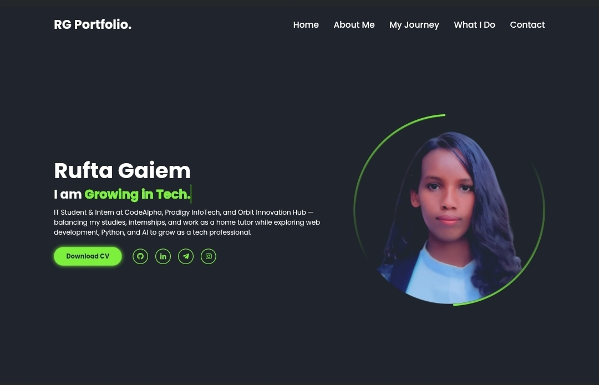

# CodeAlpha_Build-Your-Own-Portfolio-Site
# 🌐 Rufta Gaiem - Personal Portfolio

This is my personal portfolio website showcasing my journey, skills, projects, and experiences.  
Built with **HTML, CSS, and JavaScript**.

## 🚀 Live Demo
👉 [View Portfolio](https://rufta-g20.github.io/CodeAlpha_Build-Your-Own-Portfolio-Site/)

## 📸 Screenshot

## 📂 Features
- Responsive design for all devices 📱💻
- Sections: Home, About, Journey, What I Do, Contact ✨
- Smooth animations and hover effects
- Clickable project demos
- Contact form integrated with Formspree

## 🛠️ Technologies Used
- **HTML5**
- **CSS3**
- **JavaScript (Vanilla JS)**
- **Font Awesome & Boxicons** for icons

## 🤝 Contributing
This project is personal, but suggestions and improvements are welcome.  
Feel free to fork it and submit pull requests.

## 📬 Contact Me
- **Email**: ruftagaim@gmail.com  
- **Phone**: (+251) 976 693 034  
- **GitHub**: [rufta-g20](https://github.com/rufta-g20)  
- **LinkedIn**: [Rufta Gaiem Weldegiorgis](https://www.linkedin.com/in/rufta-gaiem-weldegiorgis-b36426329)

---
⭐ Don’t forget to star this repo if you like my portfolio!
